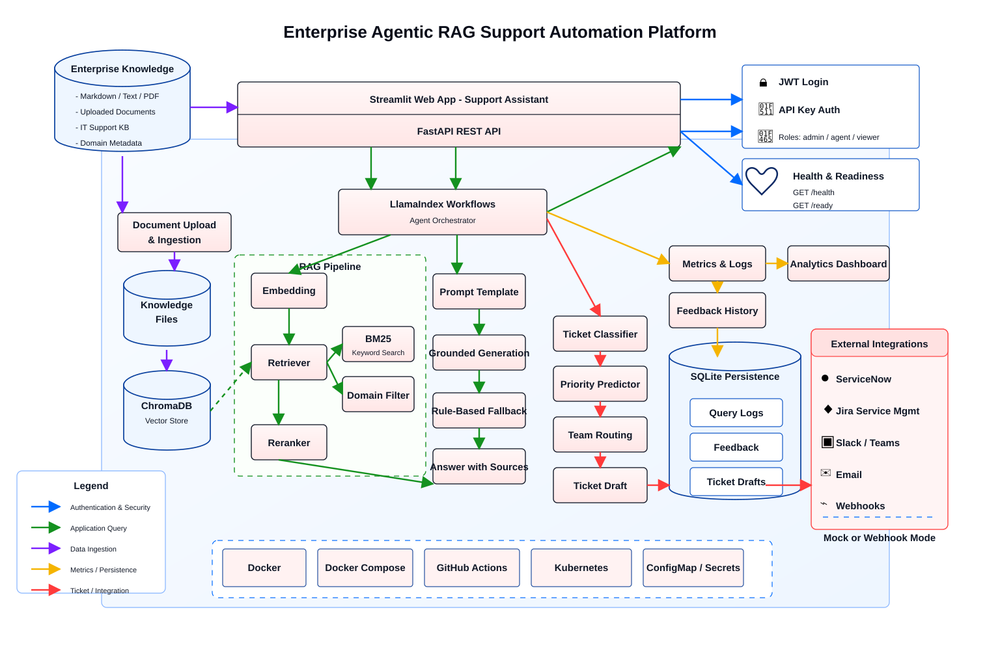

# 🤖 Enterprise Agentic RAG Support Automation Platform

A production-ready AI agent that helps enterprise IT and support teams answer, triage, route, and respond to support issues using LlamaIndex Workflows-based orchestration + Retrieval-Augmented Generation (RAG).

## 🌟 Why This Project Exists

Enterprise IT support teams spend valuable time answering repeated questions, searching knowledge-base documents, triaging unclear issues, and routing tickets to the right team.

This system acts as an AI copilot for support automation, helping reduce response time, improve ticket quality, and generate grounded answers from internal documentation.

The agent can:

- Retrieve relevant knowledge-base content
- Generate source-backed support answers
- Classify issues
- Predict priority
- Recommend routing
- Suggest next steps
- Create ticket drafts
- Track confidence
- Capture feedback

## 🏗️ System Architecture



High-level workflow:

User support question or uploaded document  
➡️ LlamaIndex Workflows-based orchestration  
➡️ RAG pipeline retrieves relevant knowledge-base chunks from ChromaDB and BM25  
➡️ LangChain-powered grounded generation or offline fallback  
➡️ Structured support response with sources, priority, routing, confidence, and ticket draft

Core stack:

- FastAPI for API backend
- Streamlit for web UI
- LlamaIndex Workflows for agent orchestration
- ChromaDB for vector search
- BM25 for keyword retrieval
- SentenceTransformers for embeddings
- PyTorch multi-task ticket classifier with shared layers, category head, and priority head
- TF-IDF + Logistic Regression baseline for supervised NLP comparison
- LangChain / OpenAI for optional grounded LLM generation
- SQLite + JSONL logs for persistence and observability
- Mock or webhook-based ITSM and chat integrations
- Docker for containerization
- Kubernetes manifests for deployment readiness

## ✨ Key Features

🔎 Support Automation Agent

- Ask IT support questions or upload support documents
- Retrieve relevant knowledge-base content using hybrid search
- Generate source-backed support answers
- Classify issues, predict priority, and recommend routing using hybrid rules + supervised NLP/ML
- Create ticket-ready drafts with suggested next steps
- Prepare mock or webhook-based ITSM tickets and chat notifications

🧠 Agentic Workflow

- Coordinate retrieval, answer generation, ticket intelligence, and escalation decisions
- Use LlamaIndex Workflows to run staged support automation orchestration
- Track confidence and detect low-confidence cases
- Use LangChain-powered grounded generation when LLM access is enabled
- Fall back to deterministic offline answers for local testing

📊 Analytics and Evaluation

- Capture user feedback and query logs
- Track latency, workflow-stage timing, fallback rate, confidence, categories, and agent decisions
- Evaluate retrieval quality, NLP/ML classification, routing accuracy, groundedness, and faithfulness
- Store query, feedback, and ticket draft records in SQLite

🚀 Production Readiness

- FastAPI backend with Swagger docs
- Streamlit UI for Ask, Analytics, and Upload workflows
- API key and JWT authentication
- Readiness checks and request validation
- Docker, Kubernetes manifests, and GitHub Actions CI

## 📁 Project Structure

```text
Enterprise RAG Support Automation Platform/
app/
 └── streamlit_app.py        # Streamlit UI for Ask, Analytics, and Upload workflows

src/
 ├── api.py                  # FastAPI REST API endpoints
 ├── security.py             # API key auth + JWT role-based auth
 ├── integrations.py         # Mock/webhook ITSM and chat adapters
 ├── persistence.py          # SQLite persistence for logs, feedback, and ticket drafts
 ├── orchestrator.py         # LlamaIndex Workflows orchestration and decisions
 ├── retriever.py            # Hybrid retrieval with ChromaDB + BM25
 ├── generator.py            # LangChain LLM generation + offline fallback
 ├── ticket_classifier.py    # Hybrid ML/rule category, priority, and routing logic
 ├── ml_ticket_model.py      # TF-IDF + Logistic Regression NLP ticket models
 ├── torch_ticket_model.py   # PyTorch multi-task ticket classifier
 ├── train_ticket_model.py   # PyTorch training and Logistic Regression comparison
 ├── ingest.py               # Knowledge-base ingestion and indexing
 ├── document_store.py       # Uploaded document storage
 ├── evaluator.py            # Retrieval, routing, groundedness, and faithfulness evaluation
 ├── logger.py               # Query logs, feedback logs, and metrics
 └── config.py               # Environment-based application settings

data/                        # Sample enterprise support knowledge base + ML train/validation/test labels
tests/                       # API tests and evaluation questions
k8s/                         # Kubernetes deployment manifests
.github/workflows/           # GitHub Actions CI pipeline

Dockerfile                   # API container image
docker-compose.yml           # Local multi-service runtime
Makefile                     # Common development commands
requirements.txt             # Python dependencies
.env.example                 # Environment variable template
```

`logs/`, `vectorstore/`, and `.venv/` are excluded from GitHub.

## ⚙️ How It Works

### 1. Document Ingestion

The ingestion pipeline reads Markdown, text, and PDF files from the `data/` folder.

```text
Documents -> text extraction -> chunks -> embeddings -> ChromaDB
```

Run:

```bash
python src/ingest.py
```

### 2. Early Ticket Intent Classification

Before RAG retrieval, the workflow runs a lightweight classifier to estimate the likely support area.

```text
Question -> early classifier -> retrieval intent
```

Examples:

- VPN or internet issue -> `vpn`
- password, login, or locked account -> `account`
- Duo, MFA, or push notification issue -> `mfa`

The early classification is used only to guide retrieval. Final ticket category, priority, team routing, and ticket draft generation still happen later in the workflow.

If the classifier cannot confidently identify a support area, the system uses broad retrieval across the selected domain instead of failing.

### 3. Hybrid Retrieval

The retriever narrows the knowledge base using:

- vector similarity search through ChromaDB
- BM25 keyword search
- domain metadata filtering
- early retrieval intent hints from ticket classification
- result merging
- lightweight reranking

Example:

```text
Question:
My VPN is not working after I reset my password

Likely retrieved sources:
- vpn_troubleshooting_kb.md
- password_reset_kb.md
```

### 4. Grounded Answer Generation

The generator uses retrieved chunks to produce an answer.

By default, the project uses deterministic rule-based generation so it can run locally without external API access.

To enable LLM-based grounded generation:

```env
USE_LLM_GENERATION=true
OPENAI_API_KEY=your_api_key
LLM_MODEL_NAME=gpt-4o-mini
```

The LLM prompt instructs the model to answer only from retrieved context and cite source files.

### 5. LlamaIndex Workflows Orchestration

The API calls:

```python
run_support_workflow(question, domain="it_support")
```

The orchestrator runs the support flow as staged workflow events:

- early ticket intent classification
- retrieval
- answer generation
- ticket classification
- confidence scoring
- confusion detection
- next-action decisions
- escalation recommendations
- ticket draft generation
- engineering metrics collection

Example agent decisions:

- `answer_and_create_ticket_draft`
- `ask_clarifying_question`
- `create_urgent_ticket_draft`
- `escalate_to_human`

### 6. ITSM and Chat Integration Adapters

The API prepares ticket and chat payloads for each support workflow.

By default, integrations run in `mock` mode so the project is safe to demo locally. For real systems, configure webhook URLs:

```env
ITSM_INTEGRATION_MODE=webhook
ITSM_WEBHOOK_URL=https://example.com/itsm-webhook
CHAT_INTEGRATION_MODE=webhook
CHAT_WEBHOOK_URL=https://example.com/chat-webhook
```

Use `disabled`, `mock`, or `webhook` for each integration mode.

### 7. NLP/ML Ticket Intelligence

The ticket intelligence layer combines deterministic guardrails with supervised NLP/ML models.

The PyTorch pipeline uses:

- SentenceTransformer embeddings when the model is available locally
- deterministic hashing embeddings as an offline-safe fallback
- a shared neural network layer
- a category classification head
- a priority classification head
- weighted cross-entropy for class balance
- AdamW optimization
- dropout and early stopping
- checkpoint saving and loading
- CPU, MPS, or CUDA device selection
- confidence thresholds before model predictions influence ticket decisions

The Logistic Regression baseline uses:

- text normalization
- TF-IDF vectorization
- Logistic Regression classification
- model confidence scores

It predicts:

- ticket summary
- category
- priority
- assigned support team

Example:

```json
{
  "summary": "My VPN is not working after I reset my password",
  "category": "VPN Connectivity",
  "priority": "Medium",
  "assigned_team": "Network Support",
  "classification_method": "hybrid_ml_nlp",
  "ml_model": "tfidf_logistic_regression"
}
```

Train the PyTorch multi-task classifier:

```bash
python -m src.train_ticket_model
```

The training script saves the best checkpoint to:

```text
models/ticket_multitask.pt
```

If a checkpoint exists, runtime ticket classification prefers the PyTorch multi-task model. If no checkpoint exists, the system falls back to the TF-IDF + Logistic Regression baseline and rule guardrails.

## 🔌 API Endpoints

Start the backend:

```bash
uvicorn src.api:app --reload
```

Swagger docs:

```text
http://127.0.0.1:8000/docs
```

Available endpoints:

```text
GET  /
GET  /health
GET  /ready
POST /auth/login
POST /ask
GET  /logs
POST /feedback
GET  /feedback
GET  /metrics
GET  /tickets
POST /documents/upload
```

Example request:

```json
{
  "question": "My VPN is not working after I reset my password",
  "domain": "it_support"
}
```

Example response:

```json
{
  "request_id": "6ed8718a-597a-4926-9f84-d93a7fe1507b",
  "question": "My VPN is not working after I reset my password",
  "domain": "it_support",
  "answer": "Based on the knowledge base...",
  "sources": [
    "vpn_troubleshooting_kb.md",
    "password_reset_kb.md"
  ],
  "ticket": {
    "summary": "My VPN is not working after I reset my password",
    "category": "VPN Connectivity",
    "priority": "Medium",
    "assigned_team": "Network Support"
  },
  "answer_generation_mode": "rule_based",
  "fallback_triggered": false,
  "confidence": {
    "retrieval_confidence": 0.87,
    "classification_confidence": 0.75,
    "overall_confidence": 0.82
  },
  "agent_decision": {
    "next_action": "answer_and_create_ticket_draft",
    "reason": "Sufficient confidence to answer and prepare a support ticket draft.",
    "assigned_team": "Network Support"
  },
  "ticket_draft": {
    "title": "My VPN is not working after I reset my password",
    "category": "VPN Connectivity",
    "priority": "Medium",
    "assigned_team": "Network Support"
  },
  "latency_ms": 1749.13
}
```

## 🔐 Security

The Streamlit UI uses an auth-first flow. Users see the login screen before they can access Ask, Analytics, or Upload Documents.

```text
Open Streamlit -> login -> FastAPI returns JWT -> Streamlit sends JWT on protected requests
```

This protects support questions because answers can expose internal knowledge-base content, ticket drafts, logs, and analytics.

API key authentication is also supported for service-to-service or local automation use cases.

```env
SUPPORT_API_KEY=your_api_key
```

When `SUPPORT_API_KEY` is empty, local development endpoints remain open. When it is set, protected endpoints require:

```text
x-api-key: your_api_key
```

Protected endpoints include:

- `POST /ask`
- `GET /logs`
- `POST /feedback`
- `GET /feedback`
- `GET /metrics`
- `POST /documents/upload`

JWT authentication is also supported when `JWT_SECRET_KEY` is configured:

```env
JWT_SECRET_KEY=replace-with-secret
JWT_EXPIRATION_MINUTES=60
AUTH_DEMO_ADMIN_USERNAME=admin
AUTH_DEMO_ADMIN_PASSWORD=replace-admin-password
AUTH_DEMO_AGENT_USERNAME=agent
AUTH_DEMO_AGENT_PASSWORD=replace-agent-password
```

Login endpoint:

```text
POST /auth/login
```

Roles:

- `admin`: can upload documents, view logs, view feedback, and view metrics
- `support_agent`: can ask questions and submit feedback
- `viewer`: reserved for future read-only workflows

JWT requests use:

```text
Authorization: Bearer <access_token>
```

Demo flow:

```text
1. Start FastAPI.
2. Start Streamlit.
3. Login using the configured demo agent/admin credentials.
4. Streamlit stores the JWT in session state.
5. Ask, Analytics, and Upload tabs are shown only after authentication.
```

## 🖥️ Streamlit UI

Start the backend first:

```bash
uvicorn src.api:app --reload
```

Then start the frontend:

```bash
streamlit run app/streamlit_app.py
```

After login, the UI includes three tabs:

- `Ask`: ask support questions and view answer, sources, ticket recommendation, confidence, and ticket draft
- `Analytics`: view latency, fallback rate, helpful feedback rate, category counts, and agent decision counts
- `Upload Documents`: upload Markdown, text, or PDF documents into a selected knowledge domain

## 📄 Document Upload

Supported upload types:

- `.md`
- `.txt`
- `.pdf`

Uploaded documents are saved under:

```text
data/<domain>/uploads/
```

The upload endpoint can optionally reindex the vector store after saving a document.

## 📊 Logging and Metrics

Query logs:

```text
logs/query_logs.jsonl
```

Feedback logs:

```text
logs/feedback_logs.jsonl
```

Metrics include:

- total queries
- total feedback submissions
- fallback rate
- average latency
- average workflow latency
- average answer-stage latency
- average retrieved chunk count
- average source count
- average confidence
- ticket category counts
- agent decision counts
- helpful feedback rate

## 🧪 Evaluation

Run:

```bash
python -m src.evaluator
```

The evaluator measures:

- retrieval accuracy
- category accuracy
- team routing accuracy
- priority accuracy
- NLP/ML category accuracy
- NLP/ML category weighted F1
- NLP/ML priority accuracy
- NLP/ML priority weighted F1
- PyTorch multi-task category accuracy
- PyTorch multi-task priority accuracy
- Logistic Regression baseline accuracy
- Precision@K
- Recall@K
- Top-1 source accuracy
- Mean Reciprocal Rank
- nDCG@K
- grounded answer rate
- faithfulness heuristic rate
- safe agent decision rate
- average confidence
- average latency
- average workflow latency
- average answer-stage latency
- average retrieved chunk count
- average source count

Current local evaluation result:

| Metric | Result |
|---|---:|
| Retrieval Accuracy | 100.00% |
| Category Accuracy | 90.00% |
| Team Routing Accuracy | 100.00% |
| Priority Accuracy | 100.00% |
| NLP/ML Category Accuracy | 95.00% |
| NLP/ML Category Weighted F1 | 95.06% |
| NLP/ML Priority Accuracy | 95.00% |
| NLP/ML Priority Weighted F1 | 94.76% |
| PyTorch Multi-Task Category Accuracy | 100.00% |
| PyTorch Multi-Task Category Weighted F1 | 100.00% |
| PyTorch Multi-Task Priority Accuracy | 87.50% |
| PyTorch Multi-Task Priority Weighted F1 | 87.40% |
| Logistic Baseline Category Accuracy | 93.75% |
| Logistic Baseline Category Weighted F1 | 93.65% |
| Logistic Baseline Priority Accuracy | 68.75% |
| Logistic Baseline Priority Weighted F1 | 68.21% |
| Average Precision@K | 97.50% |
| Average Recall@K | 100.00% |
| Top-1 Source Accuracy | 100.00% |
| Mean Reciprocal Rank | 100.00% |
| Average nDCG@K | 100.00% |
| Grounded Answer Rate | 100.00% |
| Faithfulness Heuristic Rate | 100.00% |
| Safe Agent Decision Rate | 100.00% |
| Average Overall Confidence | 0.88 |
| Average Latency | 53.96 ms |
| Average Workflow Latency | 52.72 ms |
| Average Answer Stage Latency | 52.36 ms |
| Average Retrieved Chunks | 1.45 |
| Average Source Count | 1.45 |

The evaluation now covers 20 curated IT support scenarios across VPN, MFA, account access, outage escalation, routing, and priority workflows. Intent-aware retrieval boosting and stricter reranking improved Average Precision@K from 46.67% to 97.50% while keeping Recall@K at 100.00%.

Retrieval-quality improvements added:

- intent-aware retrieval boosting for VPN, MFA, account access, outage, and routing queries
- stricter reranking to reduce noisy citations
- larger evaluation dataset with ambiguous, multi-intent, unsupported, and high-priority scenarios
- additional ranking metrics such as MRR, nDCG@K, and Top-1 source accuracy

## 🚀 Setup

Clone the repository:

```bash
git clone https://github.com/swathiblrs/Enterprise-Rag-Support-Platform.git
cd Enterprise-Rag-Support-Platform
```

Create and activate a virtual environment:

```bash
python3 -m venv .venv
source .venv/bin/activate
```

Install dependencies:

```bash
pip install -r requirements.txt
```

Ingest documents:

```bash
python src/ingest.py
```

Run API:

```bash
uvicorn src.api:app --reload
```

Run UI:

```bash
streamlit run app/streamlit_app.py
```

## 🛠️ Makefile Commands

```bash
make install
make test
make evaluate
make run-api
make run-ui
make docker-build
make docker-up
make docker-down
```

## 🐳 Docker

Run the full stack:

```bash
docker compose up --build
```

FastAPI:

```text
http://127.0.0.1:8000
```

Streamlit:

```text
http://127.0.0.1:8501
```

## ☸️ Kubernetes

Kubernetes manifests are provided under:

```text
k8s/
```

They include:

- namespace
- config map
- secret template
- API deployment and service
- Streamlit deployment and service
- persistent volume claims for logs and vectorstore
- ingress template

See [k8s/README.md](k8s/README.md) for deployment steps.

## 🔁 CI/CD

GitHub Actions runs on push and pull request.

The CI workflow validates:

- dependency installation
- API tests
- workflow evaluation

## 💬 Sample Questions

```text
My VPN is not working after I reset my password.
I cannot approve Duo push notifications.
My account is locked.
Company-wide authentication failure.
Multiple users cannot access VPN.
Production VPN outage for many users.
Duo MFA app stopped sending push requests.
```

## 🔮 Future Improvements

- ServiceNow and Jira ticket creation
- Slack and Microsoft Teams support
- Confluence, SharePoint, Google Drive, and S3 ingestion
- Larger enterprise evaluation datasets
- Production monitoring with Prometheus and Grafana
- Human-in-the-loop approval for high-risk ticket actions

## 🙌 Acknowledgements

Built using FastAPI, Streamlit, LlamaIndex Workflows, LangChain, ChromaDB, BM25, Docker, and Kubernetes manifests, and extended into a real-world enterprise IT support automation use case.
