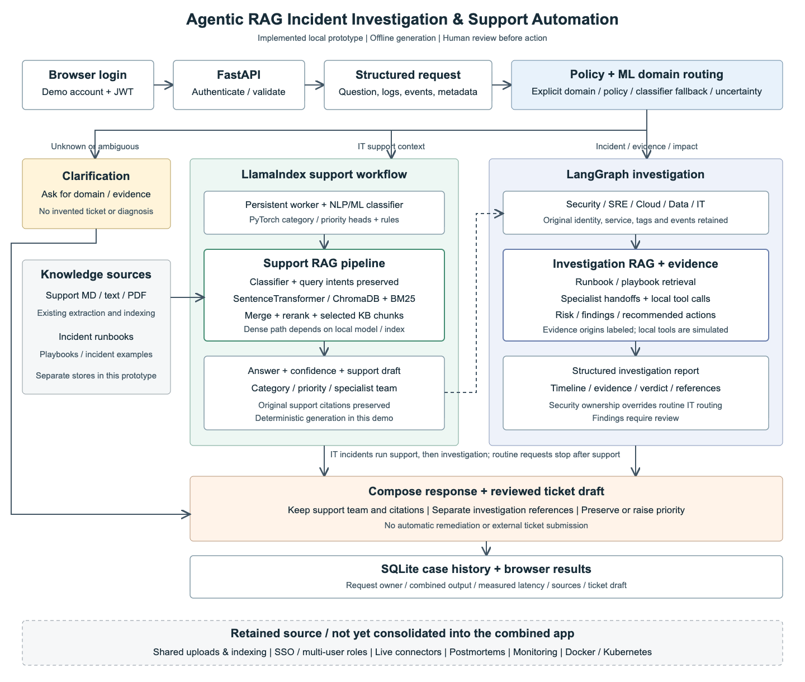

# 🤖 Enterprise Agentic RAG Support Automation Platform

An AI support and incident-investigation prototype combining LlamaIndex workflows, LangGraph orchestration, retrieval-augmented generation, and ML-based routing across security, production, cloud, data, and IT.

## 🌟 Why This Project Exists

Support teams need to distinguish routine questions from incidents, find relevant documentation, and route issues with useful context. This platform brings those steps into one authenticated interface: answer a support question, investigate an incident, or request clarification when the available information is insufficient.

## 🏗️ System Architecture



**High-level workflow**

Login -> FastAPI -> policy + ML domain routing -> LlamaIndex support workflow and/or LangGraph investigation -> source-backed answer and reviewed ticket draft -> SQLite case history.

**Core stack:** FastAPI, LlamaIndex, LangGraph, SentenceTransformers, ChromaDB, BM25, PyTorch, scikit-learn, JWT, and SQLite. The combined interface is a lightweight web UI; the original support application also includes Streamlit.

[Architecture details](combined/ARCHITECTURE.md) | [Vector diagram](combined/architecture.svg)

## ✨ Key Features

- Authentication: JWT-protected requests and user-scoped case history.
- Routing: explicit domain selection, weighted policies, and a trained classifier with abstention thresholds.
- Retrieval: semantic and BM25 search, metadata filtering, and source-aware reranking.
- Investigation: five operational domains with preserved logs, events, identity, and service context.
- Triage: ticket classification, priority, team recommendation, and human-reviewed drafts.
- Transparency: separate support citations and investigation references; simulated evidence is labeled.
- Persistence: SQLite case history and a reusable background support worker.

## 📊 Measured Results

| Metric | Result | Evaluation scope |
| --- | --- | --- |
| Hybrid domain-routing accuracy | 75% (18/24) | Separate synthetic test split |
| Recall@3 | 100% | 20 controlled support questions |
| Precision@3 | 46.7% | Same 20 questions; fixed denominator of 3 |
| Ticket category / team / priority accuracy | 90% / 95% / 100% | Same controlled support set |
| Incident regression cases | 12/12 | Offline expected-behavior checks |
| Automated tests | 15 passing | Combined integration test suite |
| Mixed-workload p95 latency | Approximately 390 ms | Historical local offline worker benchmark; 8 requests at concurrency 2 |

These are small, controlled evaluations, not production performance guarantees. The latency benchmark excludes live LLM calls and does not represent sustained load. Regression success does not establish factual correctness. Semantic groundedness and faithfulness have not been independently evaluated.

[Latest evaluation](combined/EVALUATION_V3.md) | [Raw results](combined/evaluation-v3/) | [Worker benchmark](combined/EVALUATION_V2.md) | [Model card](combined/MODEL_CARD.md)

## 📚 Datasets

- Knowledge corpus: curated support documents and incident runbooks, not private company records.
- Domain routing: 120 synthetic examples, split into 72 training, 24 validation, and 24 test examples. Labels are security, production, cloud, data, IT, and other.
- Retrieval evaluation: 20 questions with expected source documents and support labels.
- Incident evaluation: 12 scenarios with expected outcomes.
- The inherited PyTorch category/priority classifier has separate training data and is distinct from the domain router.

Documents are indexed for retrieval; they do not train or fine-tune the LLM. The routing dataset has disjoint text splits but is not independently reviewed real-world data.

## 🚀 Run Locally

Use Python 3.12 for the API and Python 3.11 for the support environment. Two environments keep the inherited dependencies isolated.

```sh
git clone https://github.com/swathiblrs/Enterprise-Agentic-RAG-Support-Automation-Platform.git
cd Enterprise-Agentic-RAG-Support-Automation-Platform/combined
python3.12 -m venv .venv-api
.venv-api/bin/pip install -r incident/requirements.txt pytest
python3.11 -m venv .venv-support
.venv-support/bin/pip install -r support/requirements.txt
export SUPPORT_PYTHON="$PWD/.venv-support/bin/python"
cd support
"$SUPPORT_PYTHON" -m src.ingest
cd ..
.venv-api/bin/python -m uvicorn combined:api --host 127.0.0.1 --port 8765
```

Initial ingestion downloads the embedding model and builds the local index. The API uses offline generation and does not submit external actions. Model downloads require internet access. Dependencies are not fully locked; fresh-environment reproducibility remains a limitation.

Open http://127.0.0.1:8765 and log in with `demo` / `local-demo-only`. This is a local demo account, not production identity management. Keep the server bound to localhost. JWTs expire on server restart. The first support request loads models; later requests reuse the worker.

## 🧪 Tests and Training

From `combined/`, with `SUPPORT_PYTHON` set and ingestion complete:

```sh
.venv-api/bin/python -m pytest test_combined.py test_regressions.py test_improvements.py -q
"$SUPPORT_PYTHON" train_domain_classifier.py
```

The second command retrains the domain router and writes its model and evaluation report. Historical evaluation artifacts are retained for traceability; some historical scripts reference the original local benchmark paths.

## 📂 Project Structure

```text
combined/
  combined.py              # Authenticated API and workflow coordination
  routing.py               # Domain policy and ML fallback
  domain_classifier.py     # Portable trained-model inference
  domain_dataset.json      # Synthetic train/validation/test examples
  train_domain_classifier.py
  support_client.py        # Serialized persistent subprocess client
  support_worker.py        # LlamaIndex support worker
  evidence_provenance.py   # Evidence-origin labels
  index.html               # Combined login and case interface
  support/                 # Support RAG and ticket classification
  incident/                # LangGraph investigation implementation
  evaluation-v3/           # Latest controlled results
  test_*.py                # Combined regression tests
src/, app/, tests/         # Preserved original support application
```

The original support application remains at the repository root. Its Docker, Kubernetes, and CI assets are not deployment manifests for the combined API. Its original README is retained at [docs/ORIGINAL_SUPPORT_README.md](docs/ORIGINAL_SUPPORT_README.md).

## 🔮 Limitations and Next Steps

This is an integrated prototype, not a production-ready service. Some incident evidence is simulated and all findings require review. Shared document ingestion, production SSO/roles, live connectors, monitoring, postmortems, and unified deployment remain to be consolidated. Existing connector source does not mean those integrations are active in the combined API.

Next priorities are independently labeled evaluation data, live integration testing, actual LLM quality/cost measurements, concurrent-load testing, and production access controls.
