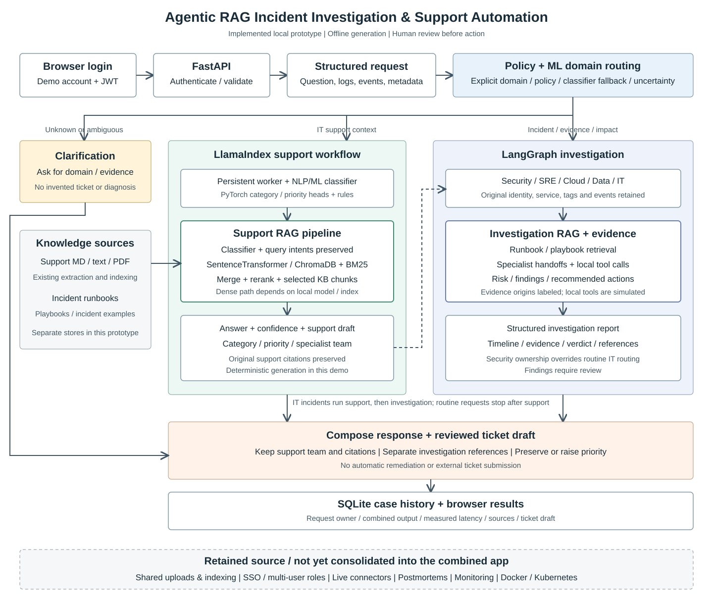

# Combined prototype architecture

## Request lifecycle

1. The browser obtains a JWT from the local login endpoint. FastAPI checks the token before executing a case.
2. The request carries the question, severity, domain and optional evidence. The JSON API also accepts the original source, title, description, tags, identity fields, service metadata and timestamp.
3. A deterministic policy with a trained fallback identifies active domain signals, accounts for common negation/background clauses, prioritizes security signals and uses an explicitly selected domain when provided. Ambiguous or unknown requests ask for clarification. Scores are weights, not calibrated probabilities.
4. Requests with IT support context call a persistent Python worker. The worker runs the existing LlamaIndex workflow, including early NLP/ML classification, support retrieval, answer generation, priority prediction and team assignment.
5. Incidents run the existing LangGraph graph for security, production, cloud, data or IT. An IT incident can execute both engines in sequence. Supplied metadata is preserved in the original incident/alert schemas. The local graph uses retrieved runbooks, specialist exchanges and simulated tool evidence. Evidence origins are labeled as user-supplied, local simulation or rule-derived; none is asserted to be independently verified.
6. The response composer attaches investigation findings to the support draft. It preserves IT specialist ownership and support citations; investigation citations are stored separately. Security cases assign SOC and retain the original support team as context. Priority cannot fall below the existing support priority or an explicitly supplied severity.
7. FastAPI stores the result with the user's identity in SQLite and returns it to the browser. All resulting actions remain recommendations requiring review.

## Where RAG and ML live

The support lane contains the trainable PyTorch category/priority classifier, with its existing fallback rules and Logistic Regression support. Its RAG path uses SentenceTransformer embeddings and ChromaDB when available, BM25 search, metadata/intents, reranking and source-backed answer generation.

The incident lane retrieves runbooks and playbooks for the LangGraph investigation. This demo uses local lexical retrieval and deterministic reasoning. The copied engine has optional PostgreSQL/pgvector and LLM provider paths, but those are not enabled by this demo.

The top-level domain router combines explicit policy with a character-TF-IDF Logistic Regression fallback trained for five domains plus other. Low confidence or a small score margin triggers clarification. The separate PyTorch classifier predicts IT category and priority. See MODEL_CARD.md for the small synthetic dataset and evaluation limits.

## Process and deployment boundaries

The FastAPI process runs the integration policy and LangGraph engine. One long-running subprocess uses the original support virtual environment and loads LlamaIndex/ML dependencies once. Calls are serialized with a bounded wait; a timed-out or exited worker is stopped and restarted on the next call. Server shutdown closes the worker.

Docker would package these processes and dependencies. Kubernetes would run, restart and scale containers with persistent volumes. Neither is a stage through which a question passes, and neither is running this local demo. The existing deployment files have not been consolidated for this combined application.

## Current boundaries

- Demo login is a local account, not company SSO or a production identity service.
- Source documents and retrieval stores remain separate. Shared uploads/indexing are not exposed through the new interface.
- External connectors, postmortems and monitoring remain in copied source, not fully integrated API features.
- The worker serializes support inference; horizontal scaling and sustained load testing remain future work.
- Local simulated evidence is not proof of a real incident. True groundedness and faithfulness require a separate semantic evaluation.

No merge or push is required to try this local prototype.

